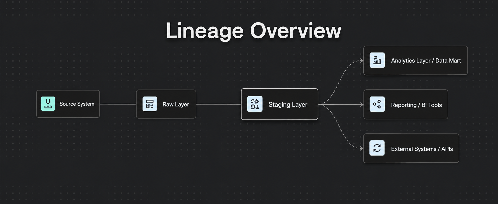
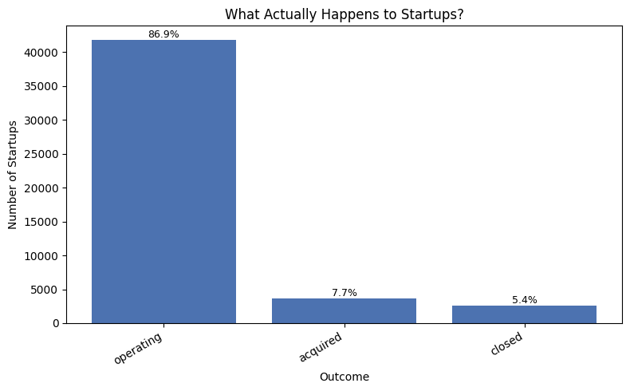
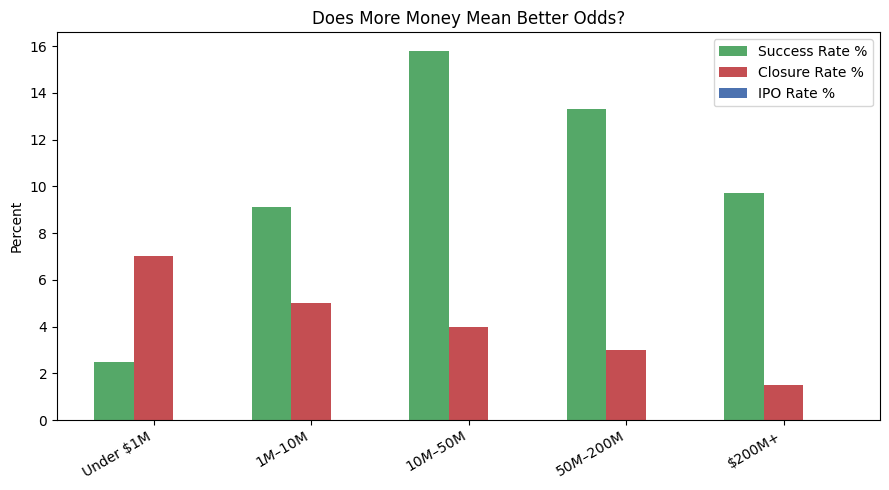
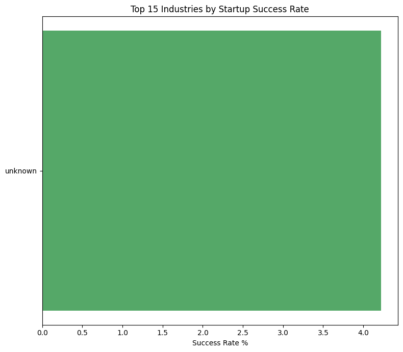
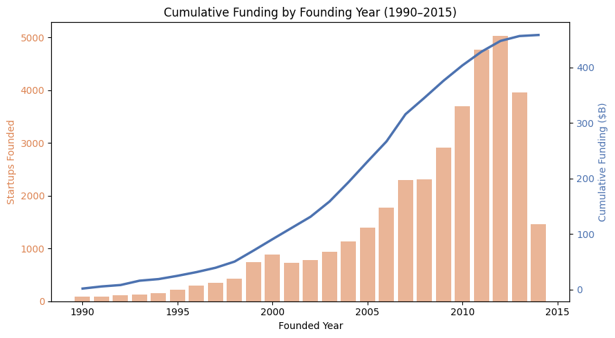
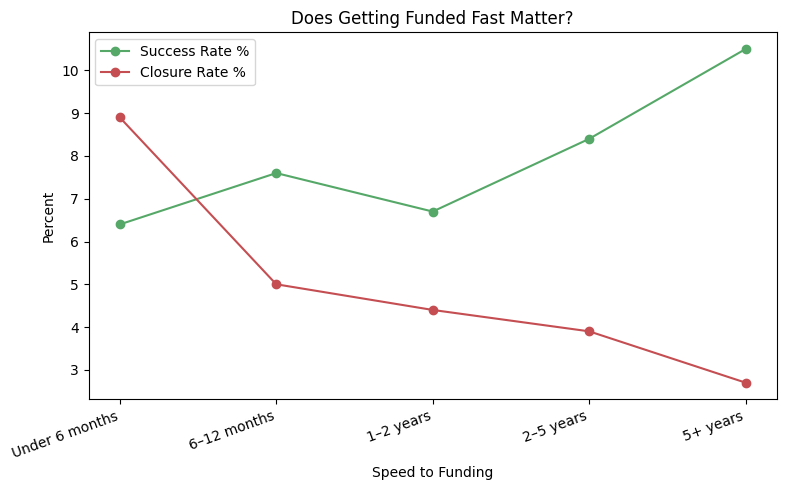
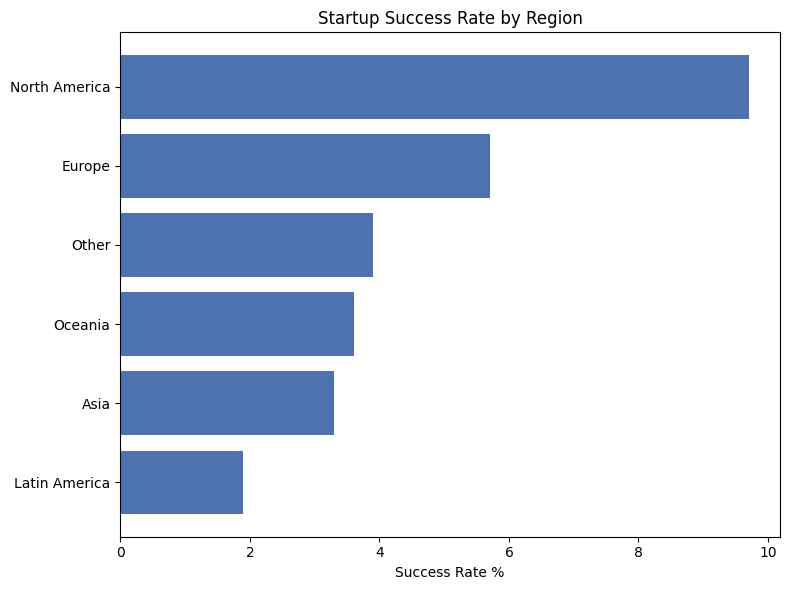
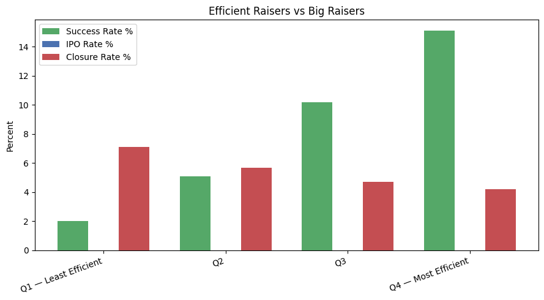

# VentureScope — Startup Outcomes Analytics

A dbt + Databricks (PySpark) analytics project that answers a simple question with data:
**what actually happens to startups, and does more funding, faster funding, geography, or raising efficiency change the odds?**

Built on the [Crunchbase Startup Investments dataset](https://www.kaggle.com/datasets/arindam235/startup-investments-crunchbase) (Kaggle), modeled through a dbt-style raw → staging → marts pipeline, and queried with Spark SQL on Databricks.

---

## Architecture

Data flows through four layers, from raw source extracts to consumption-ready marts:



| Layer | Purpose |
|---|---|
| **Source System** | Raw Crunchbase CSV exports (companies, funding rounds, acquisitions, IPOs) |
| **Raw Layer** | Unmodified landing tables, 1:1 with source files |
| **Staging Layer** | Cleaned, typed, deduplicated; business logic (buckets, flags, categories) applied |
| **Analytics Layer / Data Mart** | `venturescope_marts.*` — the tables queried below |
| **Reporting / BI Tools & External Systems / APIs** | Consumers of the marts (SQL Editor, dashboards, this notebook) |

**Key marts used:**
- `venturescope_marts.startup_outcomes` — one row per startup, with outcome, funding, founding year, region, and derived flags (`is_successful_exit`, `is_closed`, `is_ipo`)
- `venturescope_marts.category_survival_rates` — outcome rates rolled up by industry category
- `venturescope_marts.funding_efficiency` — startups bucketed into efficiency quartiles (funding raised vs. rounds taken)

---

## Tech Stack

- **Databricks** — compute + SQL Editor
- **PySpark / Spark SQL** — query execution (`spark.sql(...)`)
- **dbt** — raw → staging → marts transformation layer
- **matplotlib** — chart generation
- **pandas** — result shaping, CSV export

---

## Results

### 1. What Actually Happens to Startups?



The overwhelming majority of startups in the dataset are still **operating (86.9%)**. Only **7.7% are acquired** and **5.4% close** outright. "Successful exit" (acquisition or IPO) is the minority outcome, and outright failure is rarer in the data than most startup mythology suggests — though "operating" doesn't distinguish a thriving company from one that's quietly stalled.

### 2. Does More Money Mean Better Odds?



Success rate climbs sharply from **Under $1M (2.5%)** to a peak at **$10M–$50M (15.8%)**, then **declines** for **$50M–$200M (13.3%)** and **$200M+ (9.7%)**. Closure rate falls steadily as funding increases (7.0% → 1.5%), so more capital does reduce shutdown risk. But the success curve is not monotonic — **there's a sweet spot around $10M–$50M**, not "more is always better." IPO rate is negligible across every bucket, reinforcing that IPO is a rare outcome regardless of funding size.

### 3. Which Industries Survive Best — ⚠️ Data Quality Bug Identified



This query was supposed to return 15 differentiated industry categories ranked by success rate. Instead it returns a **single `unknown` row at 4.2%**, meaning every startup in the rollup collapsed into one bucket instead of 15.

**Why this is a real finding, not just a broken chart:** the existing dbt tests on `category_survival_rates` (row counts, not-null checks) all pass, because `'unknown'` is a valid non-null string — it satisfies a `not_null` test perfectly while still being wrong. The bug only becomes visible once you aggregate and look at *cardinality*, which is exactly what this query does. In other words, **this BI query is functioning as a data-quality check the unit tests don't cover.**

**Root cause — most likely candidates, in order of likelihood:**

1. **Delimiter/parsing mismatch in enrichment logic.** Crunchbase's raw `category_list` field is typically pipe- or comma-delimited (e.g. `Software|SaaS|Enterprise`), not a single value. If staging derives `primary_category` with something like `SPLIT(category_list, '|')[0]`, but the raw field uses a different delimiter, is empty, or the array index is off, every row falls through to a `COALESCE(..., 'unknown')` fallback — and that fallback silently absorbs the entire table instead of erroring.
2. **Join key mismatch, not a null value.** If `primary_category` comes from a lookup/dimension join (raw category → cleaned taxonomy) rather than inline string logic, a mismatch in casing, whitespace, or key type (category ID vs. category name) means the join matches zero rows, and every row defaults to `unknown`.
3. **Wrong aggregation grain.** Less likely given the clean single-bar output, but worth ruling out: grouping post-join on a column that only ever resolves to a placeholder value produces this exact signature — one row, real numbers, wrong dimension.

**Diagnostic query to run next**, against the staging table feeding this mart:

```sql
SELECT
  primary_category,
  COUNT(*) AS n
FROM venturescope_marts.staging_startups  -- adjust to the actual upstream table
GROUP BY primary_category
ORDER BY n DESC
LIMIT 20;
```

If that also returns 100% `unknown`, the bug is in the staging model's extraction logic (case 1 or 2). If it returns real categories but the mart doesn't, the bug is in the mart's own join/aggregation (case 3).

**Status:** not fixed yet — the chart above stays labeled "error state" until `category_survival_rates` is rebuilt and this query is rerun.

### 4. Cumulative Funding by Founding Year (1990–2015)



Startups founded per year grew slowly through the 1990s, then accelerated hard after 2005, **peaking around 2011–2012 (~5,000 startups founded)** before tapering off — largely a right-censoring effect, since later cohorts have had less time to raise. Cumulative funding raised by these cohorts crosses **~$460B by 2015**, with the steepest growth concentrated in the 2009–2012 founding years — the post-2008 startup boom.

### 5. Does Getting Funded Fast Matter?



This one runs counter to the "move fast" instinct. Startups that took **5+ years to get funded have the highest success rate (10.5%)** and the **lowest closure rate (2.7%)**. Startups funded in **under 6 months** have the **lowest success rate (6.4%)** and **highest closure rate (8.9%)**. Success rate dips slightly at the 1–2 year mark (6.7%) before climbing steadily through 2–5 years (8.4%) and 5+ years. Read carefully: this likely reflects survivorship and maturity bias — a startup that's still around and getting funded after 5 years has already proven durability — rather than proof that slow fundraising *causes* success.

### 6. Startup Success Rate by Region



**North America leads clearly at 9.7% success rate**, followed by Europe (5.7%), then a cluster of "Other" (3.9%), Oceania (3.6%), and Asia (3.3%), with Latin America lowest at 1.9%. North America's rate is nearly 5x Latin America's — a substantial geographic gap in outcomes.

### 7. Efficient Raisers vs. Big Raisers



Startups are bucketed into quartiles by funding efficiency (funding raised relative to number of rounds taken). The pattern is stark and monotonic: **Q4 (most efficient) has the highest success rate at 15.1%** and lowest closure rate (4.2%), while **Q1 (least efficient) has the lowest success rate (2.0%)** and highest closure rate (7.1%). Unlike the noisier "more money = better odds" relationship in Query 2, efficiency of capital use shows a clean, consistent gradient — this is arguably the strongest single predictor of outcome in the whole analysis.

---

## Known Issues / Next Steps

- [ ] **Fix `category_survival_rates`**: `primary_category` resolves to `unknown` for 100% of rows. Run the diagnostic query above against the staging layer to isolate whether this is a parsing bug (delimiter/index) or a join-key mismatch, then rebuild the model and add a cardinality/distinct-count test so this can't silently regress again.
- [x] Speed to funding, geography, and funding efficiency queries (5–7) — captured above.
- [ ] Confirm the `CATALOG` variable in `venturescope_queries.py` matches your actual Unity Catalog name (previously hit a `PARSE_SYNTAX_ERROR` on a hyphenated catalog name — fixed by wrapping in backticks).
- [ ] Once Query 3 is fixed, rerun the full set and refresh this README before publishing externally (e.g., LinkedIn).

---

## How to Run

1. Open `venturescope_queries.py` as a Databricks notebook (or attach it as a script to a cluster).
2. Set `CATALOG` and `SCHEMA` at the top to match your Unity Catalog / database.
3. Run all cells — each query displays its result table, renders a matplotlib chart, and saves both a CSV and PNG to `/dbfs/FileStore/venturescope_results/`.
4. Pull the numbers and PNGs from that folder for reporting.

---

## Data Source

[Startup Investments (Crunchbase)](https://www.kaggle.com/datasets/arindam235/startup-investments-crunchbase) — Kaggle
